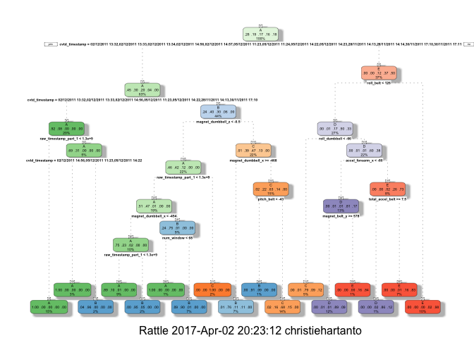

Practical Machine Learning Project
----------------------------------

#### Background

Using devices such as Jawbone Up, Nike FuelBand, and Fitbit it is now
possible to collect a large amount of data about personal activity
relatively inexpensively. These type of devices are part of the
quantified self movement – a group of enthusiasts who take measurements
about themselves regularly to improve their health, to find patterns in
their behavior, or because they are tech geeks. One thing that people
regularly do is quantify how much of a particular activity they do, but
they rarely quantify how well they do it. In this project, your goal
will be to use data from accelerometers on the belt, forearm, arm, and
dumbell of 6 participants. They were asked to perform barbell lifts
correctly and incorrectly in 5 different ways. More information is
available from the website here:
<http://groupware.les.inf.puc-rio.br/har> (see the section on the Weight
Lifting Exercise Dataset).

#### Data

The training data for this project are available here:
<https://d396qusza40orc.cloudfront.net/predmachlearn/pml-training.csv>

The test data are available here:
<https://d396qusza40orc.cloudfront.net/predmachlearn/pml-testing.csv>

The data for this project come from this source:
<http://groupware.les.inf.puc-rio.br/har>. If you use the document you
create for this class for any purpose please cite them as they have been
very generous in allowing their data to be used for this kind of
assignment.

#### Preliminary Work

An overall pseudo-random number generator seed was set at 1234 for all
code. In order to reproduce the results below, the same seed should be
used. Different packages were downloaded and installed, such as caret
and randomForest. These should also be installed in order to reproduce
the results below

##### Cross Validation

Cross-validation will be performed by subsampling the training data set
randomly without replacement into 2 subsamples: subTraining data (75% of
the original Training data set) and subTesting data (25%). The models
will be fitted on the subTraining data set and tested on the subTesting
data. Once the most accurate model is chosen, it will be tested on the
original testing data set.

###### Expected Out-of-Sample Error

The expected out-of-sample error will correspond to the quantity:
1-accuracy in the cross-validation data. Accuracy is the proportion of
correct classified observation over the total sample in the subTesting
data set. Expected accuracy is the expected accuracy in the
out-of-sample data set. Thus, the expected value of the out-of-sample
error will correspond to the expected number of misclassified
observations/total observations in the Test data set, which is the
quantity: 1-accuracy found from the cross-validation data set.

The outcome variable “classe” is an unordered factor variable. Thus, one
can choose the error type as 1-accuracy. The training data set has a
large sample size with N= 19622. This allow us to divide our Training
sample into subTraining and subTesting to allow cross-validation.
Features with all missing values will be discarded as well as features
that are irrelevant. All other features will be kept as relevant
variables. Decision tree and random forest algorithms are known for
their ability of detecting the features that are important for
classification.

#### Analysis

Packages, Libraries, Seed

    library(caret)

    ## Loading required package: lattice

    ## Loading required package: ggplot2

    library(rpart)
    library(rpart.plot)
    library(rattle)

    ## Warning: Failed to load RGtk2 dynamic library, attempting to install it.

    ## Please install GTK+ from http://r.research.att.com/libs/GTK_2.24.17-X11.pkg

    ## If the package still does not load, please ensure that GTK+ is installed and that it is on your PATH environment variable

    ## IN ANY CASE, RESTART R BEFORE TRYING TO LOAD THE PACKAGE AGAIN

    ## Rattle: A free graphical interface for data mining with R.
    ## Version 4.1.0 Copyright (c) 2006-2015 Togaware Pty Ltd.
    ## Type 'rattle()' to shake, rattle, and roll your data.

    library(randomForest)

    ## randomForest 4.6-12

    ## Type rfNews() to see new features/changes/bug fixes.

    ## 
    ## Attaching package: 'randomForest'

    ## The following object is masked from 'package:ggplot2':
    ## 
    ##     margin

    set.seed(1234)

Load data sets and preliminary cleaning

    trainUrl <- "http://d396qusza40orc.cloudfront.net/predmachlearn/pml-training.csv"
    testUrl <- "http://d396qusza40orc.cloudfront.net/predmachlearn/pml-testing.csv"
    training <- read.csv(url(trainUrl), na.strings=c("NA","#DIV/0!",""))
    testing <- read.csv(url(testUrl), na.strings=c("NA","#DIV/0!",""))

Partitioning the Data

    inTrain <- createDataPartition(y=training$classe, p=0.6, list=FALSE)
    myTraining <- training[inTrain, ]; myTesting <- training[-inTrain, ]
    dim(myTraining); dim(myTesting)

    ## [1] 11776   160

    ## [1] 7846  160

Cleaning the data

    myDataNZV <- nearZeroVar(myTraining, saveMetrics=TRUE)

    myNZVvars <- names(myTraining) %in% c("new_window", "kurtosis_roll_belt", "kurtosis_picth_belt",
    "kurtosis_yaw_belt", "skewness_roll_belt", "skewness_roll_belt.1", "skewness_yaw_belt",
    "max_yaw_belt", "min_yaw_belt", "amplitude_yaw_belt", "avg_roll_arm", "stddev_roll_arm",
    "var_roll_arm", "avg_pitch_arm", "stddev_pitch_arm", "var_pitch_arm", "avg_yaw_arm",
    "stddev_yaw_arm", "var_yaw_arm", "kurtosis_roll_arm", "kurtosis_picth_arm",
    "kurtosis_yaw_arm", "skewness_roll_arm", "skewness_pitch_arm", "skewness_yaw_arm",
    "max_roll_arm", "min_roll_arm", "min_pitch_arm", "amplitude_roll_arm", "amplitude_pitch_arm",
    "kurtosis_roll_dumbbell", "kurtosis_picth_dumbbell", "kurtosis_yaw_dumbbell", "skewness_roll_dumbbell",
    "skewness_pitch_dumbbell", "skewness_yaw_dumbbell", "max_yaw_dumbbell", "min_yaw_dumbbell",
    "amplitude_yaw_dumbbell", "kurtosis_roll_forearm", "kurtosis_picth_forearm", "kurtosis_yaw_forearm",
    "skewness_roll_forearm", "skewness_pitch_forearm", "skewness_yaw_forearm", "max_roll_forearm",
    "max_yaw_forearm", "min_roll_forearm", "min_yaw_forearm", "amplitude_roll_forearm",
    "amplitude_yaw_forearm", "avg_roll_forearm", "stddev_roll_forearm", "var_roll_forearm",
    "avg_pitch_forearm", "stddev_pitch_forearm", "var_pitch_forearm", "avg_yaw_forearm",
    "stddev_yaw_forearm", "var_yaw_forearm")
    myTraining <- myTraining[!myNZVvars]

    dim(myTraining)

    ## [1] 11776   100

    myTraining <- myTraining[c(-1)]

    trainingV3 <- myTraining 
    for(i in 1:length(myTraining)) { 
            if( sum( is.na( myTraining[, i] ) ) /nrow(myTraining) >= .6 ) { 
            for(j in 1:length(trainingV3)) {
                if( length( grep(names(myTraining[i]), names(trainingV3)[j]) ) ==1)  { 
                    trainingV3 <- trainingV3[ , -j] 
                }   
            } 
        }
    }

    dim(trainingV3)

    ## [1] 11776    58

    myTraining <- trainingV3
    rm(trainingV3)

    clean1 <- colnames(myTraining)
    clean2 <- colnames(myTraining[, -58])
    myTesting <- myTesting[clean1]
    testing <- testing[clean2]

    dim(myTesting)

    ## [1] 7846   58

    dim(testing)

    ## [1] 20 57

    for (i in 1:length(testing) ) {
            for(j in 1:length(myTraining)) {
            if( length( grep(names(myTraining[i]), names(testing)[j]) ) ==1)  {
                class(testing[j]) <- class(myTraining[i])
            }      
        }      
    }

    testing <- rbind(myTraining[2, -58] , testing)
    testing <- testing[-1,]

#### Decision Tree

    modFitA1 <- rpart(classe ~ ., data=myTraining, method="class")
    fancyRpartPlot(modFitA1)

    predictionsA1 <- predict(modFitA1, myTesting, type = "class")
    confusionMatrix(predictionsA1, myTesting$classe)

    ## Confusion Matrix and Statistics
    ## 
    ##           Reference
    ## Prediction    A    B    C    D    E
    ##          A 2161   61    5    3    0
    ##          B   50 1271   95   64    0
    ##          C   21  177 1242  203   65
    ##          D    0    9   19  899   92
    ##          E    0    0    7  117 1285
    ## 
    ## Overall Statistics
    ##                                           
    ##                Accuracy : 0.8741          
    ##                  95% CI : (0.8665, 0.8813)
    ##     No Information Rate : 0.2845          
    ##     P-Value [Acc > NIR] : < 2.2e-16       
    ##                                           
    ##                   Kappa : 0.8407          
    ##  Mcnemar's Test P-Value : NA              
    ## 
    ## Statistics by Class:
    ## 
    ##                      Class: A Class: B Class: C Class: D Class: E
    ## Sensitivity            0.9682   0.8373   0.9079   0.6991   0.8911
    ## Specificity            0.9877   0.9670   0.9281   0.9817   0.9806
    ## Pos Pred Value         0.9691   0.8588   0.7272   0.8822   0.9120
    ## Neg Pred Value         0.9874   0.9612   0.9795   0.9433   0.9756
    ## Prevalence             0.2845   0.1935   0.1744   0.1639   0.1838
    ## Detection Rate         0.2754   0.1620   0.1583   0.1146   0.1638
    ## Detection Prevalence   0.2842   0.1886   0.2177   0.1299   0.1796
    ## Balanced Accuracy      0.9779   0.9021   0.9180   0.8404   0.9359

#### Random Forest

    modFitB1 <- randomForest(classe ~. , data=myTraining)
    predictionsB1 <- predict(modFitB1, myTesting, type = "class")
    confusionMatrix(predictionsB1, myTesting$classe)

    ## Confusion Matrix and Statistics
    ## 
    ##           Reference
    ## Prediction    A    B    C    D    E
    ##          A 2232    2    0    0    0
    ##          B    0 1516    4    0    0
    ##          C    0    0 1362    5    0
    ##          D    0    0    2 1280    0
    ##          E    0    0    0    1 1442
    ## 
    ## Overall Statistics
    ##                                         
    ##                Accuracy : 0.9982        
    ##                  95% CI : (0.997, 0.999)
    ##     No Information Rate : 0.2845        
    ##     P-Value [Acc > NIR] : < 2.2e-16     
    ##                                         
    ##                   Kappa : 0.9977        
    ##  Mcnemar's Test P-Value : NA            
    ## 
    ## Statistics by Class:
    ## 
    ##                      Class: A Class: B Class: C Class: D Class: E
    ## Sensitivity            1.0000   0.9987   0.9956   0.9953   1.0000
    ## Specificity            0.9996   0.9994   0.9992   0.9997   0.9998
    ## Pos Pred Value         0.9991   0.9974   0.9963   0.9984   0.9993
    ## Neg Pred Value         1.0000   0.9997   0.9991   0.9991   1.0000
    ## Prevalence             0.2845   0.1935   0.1744   0.1639   0.1838
    ## Detection Rate         0.2845   0.1932   0.1736   0.1631   0.1838
    ## Detection Prevalence   0.2847   0.1937   0.1742   0.1634   0.1839
    ## Balanced Accuracy      0.9998   0.9990   0.9974   0.9975   0.9999

#### Submission

    predictionsB2 <- predict(modFitB1, testing, type = "class")

    pml_write_files = function(x){
      n = length(x)
      for(i in 1:n){
        filename = paste0("problem_id_",i,".txt")
        write.table(x[i],file=filename,quote=FALSE,row.names=FALSE,col.names=FALSE)
      }
    }

    pml_write_files(predictionsB2)
